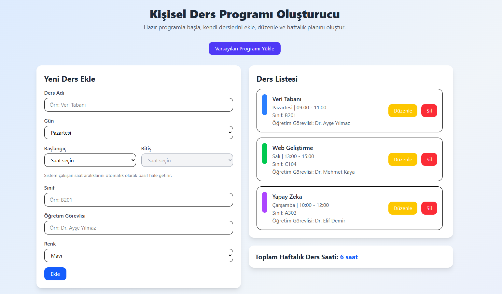

🎓 Kişisel Ders Programı Oluşturucu

Modern React + Tailwind CSS kullanılarak geliştirilmiş bir ders programı yönetim uygulaması.
Kullanıcılar haftalık ders programlarını oluşturabilir, düzenleyebilir ve tablo görünümünde görüntüleyebilir.

🚀 Özellikler

➕ Yeni ders ekleme

📋 Dersleri listeleme

✏️ Ders güncelleme

❌ Ders silme

📅 Haftalık ders programı görünümü

⏰ Ders saatleri için çakışma kontrolü

💾 LocalStorage ile veri saklama

📱 Responsive arayüz

🖥️ Uygulama Görünümü

  

🧱 Kullanılan Teknolojiler
Teknoloji	Açıklama
React	Kullanıcı arayüzü
Tailwind CSS	Stil ve tasarım
Vite	Geliştirme ve build aracı
LocalStorage	Veri saklama
Netlify	Deploy
📦 Kurulum

Projeyi çalıştırmak için:

git clone https://github.com/kullaniciadi/ders-programi.git
cd ders-programi
npm install
npm run dev
🌐 Deploy (Netlify)

Build ayarları:

Build Command: npm run build
Publish Directory: dist
📁 Proje Yapısı
src/
├── Components/
│   ├── CourseForm.jsx
│   ├── CourseList.jsx
│   ├── EditCourseModal.jsx
│   └── WeeklySchedule.jsx
│
├── Pages/
│   └── Home.jsx
│
├── Interfaces/
│   └── createCourse.js
│
├── data/
│   └── courses.json
│
├── App.jsx
├── main.jsx
└── index.css
👨‍💻 Geliştirici

Bu proje Web Geliştirme / JavaScript eğitimi kapsamında hazırlanmıştır.
